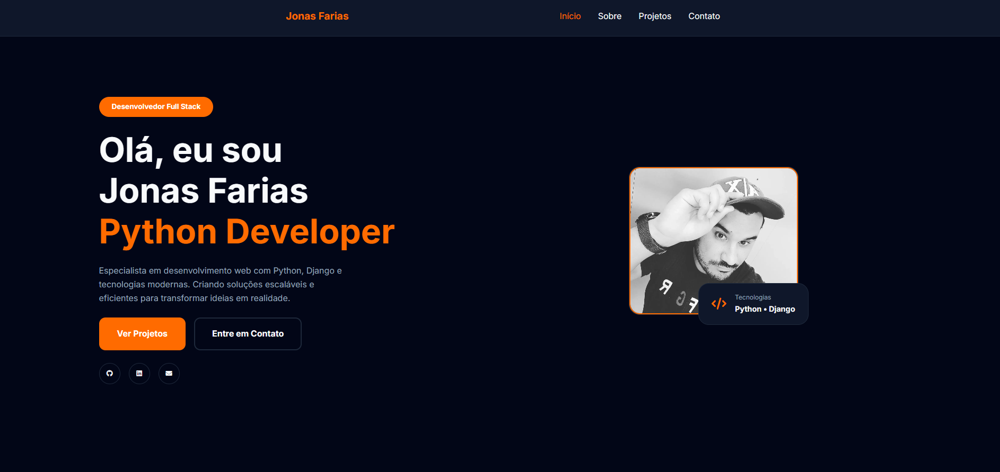

# Jonas Farias — Portfolio

Portfólio profissional desenvolvido com HTML, CSS e JavaScript
Vanilla. Containerizado com Docker e servido via Nginx.



---

## Sobre o projeto

Site portfólio com foco em apresentar projetos, stack técnica
e canais de contato de forma clara, moderna e performática.

**Design:** Dark mode com accent laranja, cards premium e
animações suaves.

**Filosofia:** Frontend estático puro — sem frameworks,
sem dependências, máxima performance.

---

## Stack

| Camada | Tecnologia |
|--------|-----------|
| Frontend | HTML5, CSS3, JavaScript Vanilla |
| Servidor | Nginx Alpine |
| Container | Docker + Docker Compose |
| DNS / SSL | Cloudflare |
| Hospedagem | VPS Ubuntu — São Paulo, BR |

---

## Seções

- **Hero** — Apresentação principal com links sociais
- **Sobre** — Perfil profissional e informações
- **Skills** — Stack técnica por categoria
- **Projetos** — Grid com filtros por tecnologia
- **Infraestrutura** — Conhecimento operacional *(em breve)*
- **Contato** — Cards diretos para Email, GitHub, LinkedIn e WhatsApp

---

## Como rodar localmente

### Com Docker (recomendado)
```bash
git clone git@github.com:JonasFarias93/portifolio.git
cd portfolio
docker compose up -d --build
```
Acessa em: `http://localhost`

### Sem Docker
Abra o `index.html` diretamente no browser ou use
um live server (ex: Live Server do VS Code).

---

## Como adicionar projetos

Edita `assets/js/projects.js`:

```js
{
    title: "Nome do Projeto",
    desc: "Descrição do projeto.",
    tags: ["Python", "Django"],
    category: ["web", "backend"],
    github: "https://github.com/...",
    demo: "https://..."
}
```

Categorias disponíveis: `web`, `backend`, `frontend`,
`api`, `linux`, `games`

---

## Como adicionar skills

Edita `assets/js/skills.js`:

```js
// Em categoria existente
{ category: "Backend", items: ["Python", "Django", "NovaSkill"] }

// Nova categoria
{ category: "Nova Categoria", items: ["Item1", "Item2"] }
```

---

## Estrutura do projeto

```txt
portfolio/
├── index.html
├── assets/
│   ├── css/
│   │   ├── variables.css
│   │   ├── style.css
│   │   ├── components.css
│   │   └── responsive.css
│   └── js/
│       ├── projects.js
│       ├── skills.js
│       ├── filters.js
│       ├── navbar.js
│       ├── animations.js
│       └── script.js
├── docker/
│   └── nginx.conf
├── docs/
│   ├── wireframe.md
│   ├── design-system.md
│   ├── structure.md
│   ├── infra.md
│   ├── decision.md
│   └── deploy-guide.md
├── .dockerignore
├── Dockerfile
└── docker-compose.yml
```

---

## Documentação

| Documento | Descrição |
|-----------|-----------|
| [Wireframe](docs/wireframe.md) | Estrutura visual e UX |
| [Design System](docs/design-system.md) | Cores, tipografia e componentes |
| [Structure](docs/structure.md) | Organização técnica do projeto |
| [Infra](docs/infra.md) | Arquitetura e configuração de produção |
| [Decisões Técnicas](docs/decision.md) | Decisões tomadas e motivos |
| [Deploy Guide](docs/deploy-guide.md) | Passo a passo para produção |

---

## Deploy

Veja o [Deploy Guide](docs/deploy-guide.md) para
instruções completas de produção com VPS + Docker + Cloudflare.

---

## Autor

**Jonas Farias**
Python Developer — São Paulo, BR

[](https://github.com/Jonasfarias93)
[](https://www.linkedin.com/in/jonas-farias/)

---

## Licença

MIT License — sinta-se livre para usar como referência.